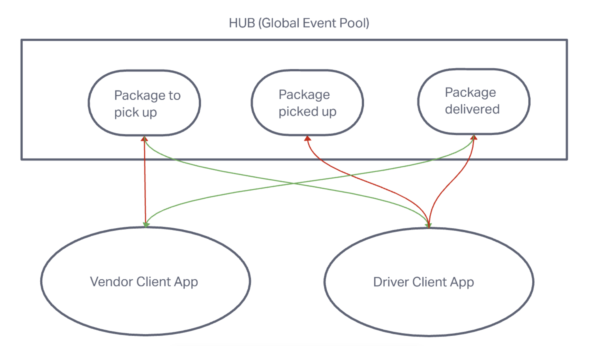

# LAB - Class 11 - Event Driven Application

CAPS Phase 1: Begin the build of an application for a product called CAPS - The Code Academy Parcel Service. In this sprint, we’ll build out a system that emulates a real world supply chain. CAPS will simulate a delivery service where vendors (such a flower shops) will ship products using our delivery service and when our drivers deliver them, each vendor will be notified that their customers received what they purchased.

This will be an event driven application that “distributes” the responsibility for logging to separate modules, using only events to trigger logging based on activity.

## Author

Guy Farley

## Problem Domain

Today, we begin the first of a 4-Phase build of the CAPS system, written in Node.js. In this first phase, our goal is to setup a pool of events and handler functions, with the intent being to refactor parts of the system throughout the week, but keep the handlers themselves largely the same. The task of “delivering a package” doesn’t change (the handler), even if the mechanism for triggering that task (the event) does.

The following user/developer stories detail the major functionality for this phase of the project.

- As a vendor, I want to alert the system when I have a package to be picked up.
- As a driver, I want to be notified when there is a package to be delivered.
- As a driver, I want to alert the system when I have picked up a package and it is in transit.
- As a driver, I want to alert the system when a package has been delivered.
- As a vendor, I want to be notified when my package has been delivered.

And as developers, here are some of the development stories that are relevant to the above.

- As a developer, I want to use industry standards for managing the state of each package.
- As a developer, I want to create an event driven system so that I can write code that happens in response to events, in real time.

## Links and Resources

<https://github.com/GuyFarley/caps>

## Setup

## How to initialize/run your application (where applicable)

This application can be pulled down from GitHub and run locally

## How to use your library (where applicable)

## Features / Routes

- Module for a Global Event PoolGlobal Event Pool (HUB)
- Module for Managing Global Package Events
  - Listens to ALL events in the Event Pool.
  - Logs a timestamp and the payload of every event.
- Module for Managing Vendor Events
  - Takes a store name as a parameter
  - When triggered, the vendor module simulates a pickup event for the given store name to the Global Event Pool:
  - emits pickup to the global event pool
  - sends a vendor order payload
  - Listens for a delivered event and responds by logging a message to the console:
- Module for Managing Driver Events.
  - Listens for a pickup event from the Global Event Pool and responds with the following:
  - Log a message to the console: DRIVER: picked up <ORDER_ID>.
  - Emit an ‘in-transit’ event to the Global Event Pool with the order payload.
  - Log a confirmation message to the console: DRIVER: delievered <ORDER_ID>.
  - Emit a ‘delivered` event to the Global Event Pool with the order payload.

## Tests

Tests to be created using Jest: Unit tests for each event handler function

## UML

